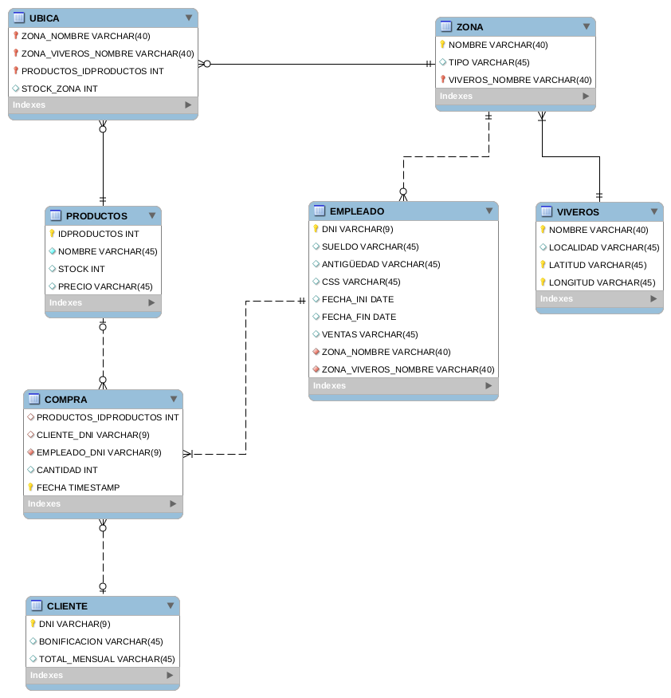
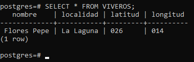
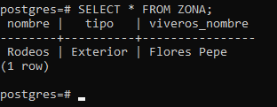
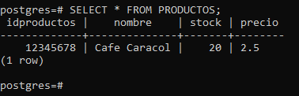
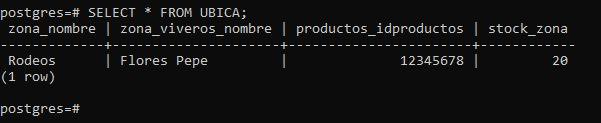
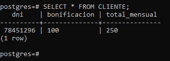
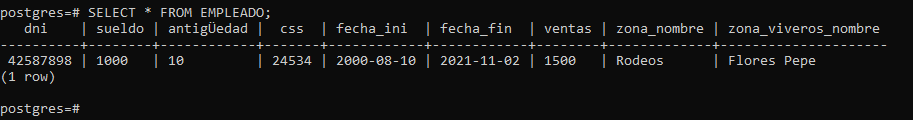
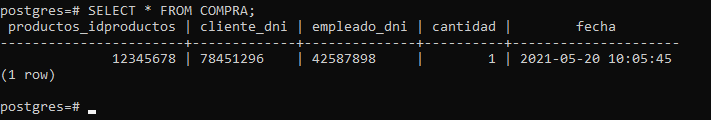

# Informe sobre Modelo Lógico Relacional: Viveros

## Imagen del diseño realizado con MySQL Workbench

## SELECT TABLA VIVEROS:

## SELECT TABLA ZONA:

## SELECT TABLA PRODUCTOS:

## SELECT TABLA UBICA:

## SELECT TABLA CLIENTE:

## SELECT TABLA EMPLEADO:

## SELECT TABLA COMPRA:

